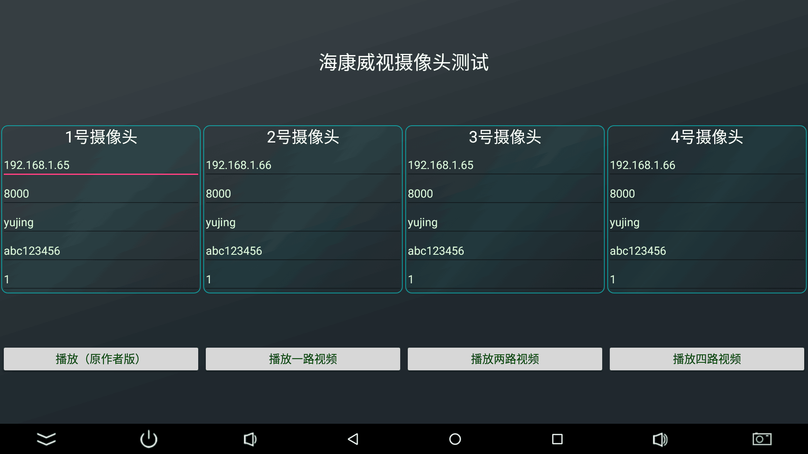
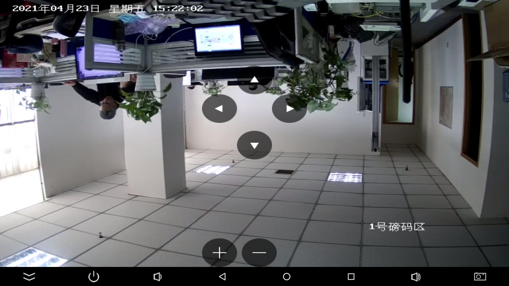
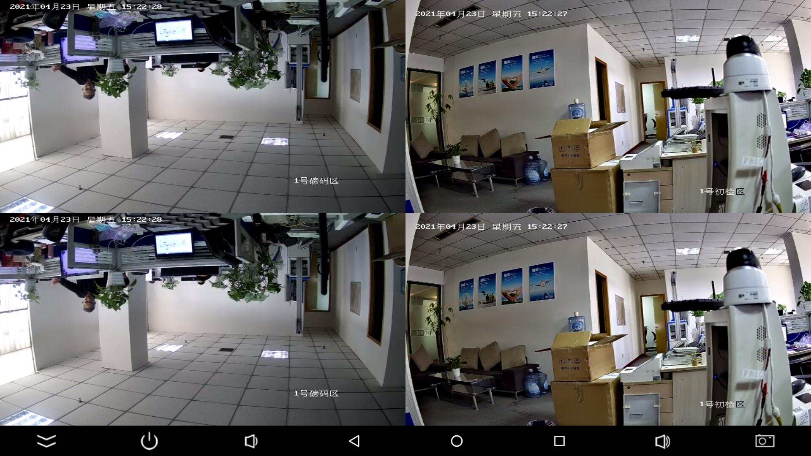

# 海康威视Android studio版 直接代码中改变参数就可以是使用

## 此项目是基于旧版SDK构建，新版SDK_demo点击前往 ：[新版本SDK_demo](https://github.com/yutils/HikVisionDemo_2023)


在作者原版demo基础上  
1.更新libs到2020版  
2.更新AndroidStudio到2022.1.1   
3.更新gradle到7.6  
4.升级到安卓13  
5.升级到Androidx  
6.升级到java8  
7.优化部分代码结构  
8.添加可控子码流变量  
9.多路播放支持  
  
## 开发环境准备
**推荐使用jetBrains Toolbox 中的android studio，并更新到最新正式版**  

【必须】打开AS的安装目录，在bin目录下找到这两个文件（studio.exe.vmoptions，studio64.exe.vmoptions）  
在其中最后一行添加	-Dfile.encoding=UTF-8   
```bat
安装目录位置
C:\Users\用户名\AppData\Local\JetBrains\Toolbox\apps\AndroidStudio\ch-0\版本\bin
如：
C:\Users\yujing\AppData\Local\JetBrains\Toolbox\apps\AndroidStudio\ch-0\211.7628.21.2111.8139111\bin
```

### 在releases中有APK可以下载： [点击跳转](https://github.com/yutils/HikVisionDemo/releases)
# 界面截图

  
  
  

## 双路播放请看  My2Activity代码
## 四路播放请看  My4Activity代码

双路播放
```java
public class My2Activity extends Activity {
    CameraManager cameraManager1 = new CameraManager();
    CameraManager cameraManager2 = new CameraManager();
    @Override
    public void onCreate(Bundle savedInstanceState) {
        super.onCreate(savedInstanceState);
        My2Binding binding = DataBindingUtil.setContentView(this, R.layout.my2);
        //设置摄像头参数
        CameraDevice cameraDevice1 = new CameraDevice("192.168.1.65", 8000, "admin", "pw&123456", 1);
        CameraDevice cameraDevice2 = new CameraDevice("192.168.1.66", 8000, "admin", "pw&123456", 1);
        //启动
        cameraManager1.initAll(this, cameraDevice1, binding.surfaceView1);
        cameraManager2.initAll(this, cameraDevice2, binding.surfaceView2);
    }

    @Override
    protected void onDestroy() {
        super.onDestroy();
        cameraManager1.onDestroy();
        cameraManager2.onDestroy();
    }
}
```
